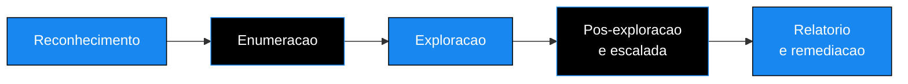

<!-- ══════════════════════ IDIOMAS / LANGUAGES ══════════════════════ -->

<!-- ══════════════════════════ BANNER ══════════════════════════ -->

  

  

  

 

<!-- Cabeçalho animado -->

  

<h1 align="center">Cybersec Portfolio</h1>

<em>Hands-on evidence of penetration tests conducted in legal and authorized environments, from reconnaissance to executive report.</em>

 

<!-- ══════════════════════════ NAVEGAÇÃO ══════════════════════════ -->

 

<!-- ══════════════════════════ SOBRE ══════════════════════════ -->

## About this portfolio

I'm Douglas Cshunderlick, a cybersecurity analyst focused on pentesting, network defense, and threat analysis. Every folder in this repository documents a real compromise, carried out in an authorized lab (TryHackMe, HackTheBox, and my own environments), with the same structure I would deliver to a client: proof of concept, step-by-step attack path, and prioritized remediation recommendations.

The goal isn't just to "capture the flag." It's to show how I reason through an intrusion end to end and, above all, how I translate a technical finding into business risk and into a remediation plan the team can actually execute.

  

<!-- ══════════════════════════ METODOLOGIA ══════════════════════════ -->

## How each test is conducted

Every report follows the same flow, aligned with the OSSTMM and the OWASP Testing Guide. The five phases below are clickable in the index and appear in detail in each case.

| Phase | What happens |
|:--|:--|
| **Reconnaissance** | Mapping the exposed surface, ports, and live services |
| **Enumeration** | Probing each service for version, weak configuration, and credentials |
| **Exploitation** | Gaining initial access, with active confirmation of the flaw |
| **Post-exploitation** | Lateral movement and escalation up to full control |
| **Reporting** | Translating the finding into business impact and prioritized remediation |

  

<!-- ══════════════════════════ RELATÓRIOS ══════════════════════════ -->

## Penetration test reports

| Machine | Platform | Difficulty | Time to root | Main vector | Status |
|:--|:--:|:--:|:--:|:--|:--:|
| **Poster** | TryHackMe | Medium | ~1h40 | PostgreSQL with default credentials + `CVE-2019-9193` | Completed |
| **Meow** | HackTheBox | Easy | ~45min | Telnet with direct root login (misconfigured Alpine) | Completed |

Click each case to open the attack summary without leaving this page.

<b>Poster · full compromise via exposed PostgreSQL</b>

 

> A PostgreSQL database reachable over the network with its factory password opened the door to command execution on the server. From there, credentials stored in plaintext and a passwordless `sudo` rule led to root access in under two hours.

**Path in brief**

1. A scan revealed port `5432` (PostgreSQL) open to the network.
2. Login with the default credential `postgres:password`.
3. System command execution by exploiting `CVE-2019-9193` (the `COPY FROM PROGRAM` function).
4. Reading configuration files holding the `dark` user's credentials in plaintext.
5. A passwordless `sudo` rule allowed becoming root.

**Why it matters:** three trivial standalone flaws (factory password, hardcoded secret, permissive `sudo`) chained together turn into a critical compromise of the entire server.

<b>Meow · direct root access over Telnet</b>

 

> An exposed Telnet service accepted root login without any barrier. A classic case of a legacy service left reachable when it should not be accessible at all.

**Path in brief**

1. A scan revealed port `23` (Telnet) open.
2. Direct connection and login as `root`, with no strong password in the way.
3. Immediate full control of the machine.

**Why it matters:** old plaintext services like Telnet have no place on any modern attack surface. The fix is to shut the service down and block the port, not to "set a better password."

 

New reports are added here as they are completed.

  

<!-- ══════════════════════════ SKILLS ══════════════════════════ -->

## Demonstrated skills

<table>
<tr>
<td valign="top" width="50%">

**Offensive**

- Service reconnaissance and enumeration (Nmap, Gobuster, ffuf)
- Exploitation of exposed services (PostgreSQL, SMB, HTTP, Telnet)
- Use of default credentials and secrets stored in plaintext
- Linux privilege escalation (sudoers, SUID, capabilities)
- Exploitation of known CVEs with proof of concept

</td>
<td valign="top" width="50%">

**Advisory**

- Professional pentest documentation (executive + technical summary)
- Severity rating and risk prioritization
- Remediation recommendations with a suggested deadline
- Translation of technical findings into business impact
- Alignment with OSSTMM and OWASP Testing Guide

</td>
</tr>
</table>

  

<!-- ══════════════════════════ ROADMAP ══════════════════════════ -->

## Upcoming reports

- [ ] Web application pentest covering the OWASP Top 10
- [ ] Initial compromise in Active Directory
- [ ] Insecure cloud configurations (AWS and Azure)
- [ ] Reconnaissance automation with Python and Bash

  

<!-- ══════════════════════════ CONTATO ══════════════════════════ -->

## Contact

  

<em>If this content helped you, a star on the repository goes a long way. Thanks for stopping by.</em>

  

