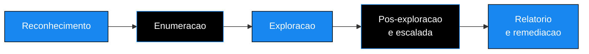

<!-- ══════════════════════ IDIOMAS / LANGUAGES ══════════════════════ -->

<!-- ══════════════════════════ BANNER ══════════════════════════ -->

  

  

  

 

<!-- Cabeçalho animado -->

  

<h1 align="center">Cybersec Portfolio</h1>

<em>Evidencia práctica de pruebas de penetración realizadas en entornos legales y autorizados, del reconocimiento al informe ejecutivo.</em>

 

<!-- ══════════════════════════ NAVEGAÇÃO ══════════════════════════ -->

 

<!-- ══════════════════════════ SOBRE ══════════════════════════ -->

## Sobre este portafolio

Soy Douglas Cshunderlick, analista de ciberseguridad enfocado en pentesting, defensa de redes y análisis de amenazas. Cada carpeta de este repositorio documenta un compromiso real, ejecutado en un laboratorio autorizado (TryHackMe, HackTheBox y entornos propios), con la misma estructura que entregaría a un cliente: prueba de concepto, ruta de ataque paso a paso y recomendaciones de corrección priorizadas.

La idea no es solo "capturar la flag". Es mostrar cómo razono una intrusión de principio a fin y, sobre todo, cómo traduzco el hallazgo técnico en riesgo de negocio y en un plan de remediación que el equipo puede ejecutar.

  

<!-- ══════════════════════════ METODOLOGIA ══════════════════════════ -->

## Cómo se realiza cada prueba

Cada informe sigue el mismo flujo, alineado con el OSSTMM y la OWASP Testing Guide. Las cinco fases a continuación son clicables en el índice y aparecen detalladas en cada caso.

| Fase | Qué ocurre |
|:--|:--|
| **Reconocimiento** | Mapeo de la superficie expuesta, puertos y servicios activos |
| **Enumeración** | Investigación de cada servicio en busca de versión, configuración débil y credencial |
| **Explotación** | Obtención del primer acceso, con confirmación activa de la falla |
| **Post-explotación** | Movimiento lateral y escalada hasta el control total |
| **Informe** | Traducción del hallazgo en impacto de negocio y corrección priorizada |

  

<!-- ══════════════════════════ RELATÓRIOS ══════════════════════════ -->

## Informes de pruebas de penetración

| Máquina | Plataforma | Dificultad | Tiempo hasta root | Vector principal | Estado |
|:--|:--:|:--:|:--:|:--|:--:|
| **Poster** | TryHackMe | Media | ~1h40 | PostgreSQL con credencial por defecto + `CVE-2019-9193` | Completado |
| **Meow** | HackTheBox | Fácil | ~45min | Telnet con login de root directo (Alpine mal configurado) | Completado |

Haz clic en cada caso para abrir el resumen del ataque sin salir de esta página.

<b>Poster · compromiso total vía PostgreSQL expuesto</b>

 

> Una base de datos PostgreSQL accesible por la red con la contraseña de fábrica abrió la puerta a la ejecución de comandos en el servidor. A partir de ahí, credenciales guardadas en texto plano y una regla de `sudo` sin contraseña llevaron al acceso de root en menos de dos horas.

**Ruta resumida**

1. El escaneo reveló el puerto `5432` (PostgreSQL) abierto a la red.
2. Inicio de sesión con la credencial por defecto `postgres:password`.
3. Ejecución de comandos en el sistema explotando la `CVE-2019-9193` (función `COPY FROM PROGRAM`).
4. Lectura de archivos de configuración con las credenciales del usuario `dark` en texto plano.
5. Una regla de `sudo` sin contraseña permitió convertirse en root.

**Por qué importa:** tres fallas aisladas y triviales (contraseña de fábrica, secreto en el código, `sudo` permisivo) encadenadas se convierten en un compromiso crítico de todo el servidor.

<b>Meow · acceso de root directo por Telnet</b>

 

> Un servicio Telnet expuesto aceptaba login de root sin ninguna barrera. Caso clásico de exposición de un servicio heredado que no debería estar accesible.

**Ruta resumida**

1. El escaneo reveló el puerto `23` (Telnet) abierto.
2. Conexión directa e inicio de sesión como `root`, sin contraseña fuerte de por medio.
3. Control total inmediato de la máquina.

**Por qué importa:** los servicios antiguos en texto plano como Telnet no pertenecen a ninguna superficie moderna. La corrección es apagar el servicio y bloquear el puerto, no "poner una contraseña mejor".

 

Aquí se agregan nuevos informes a medida que se completan.

  

<!-- ══════════════════════════ SKILLS ══════════════════════════ -->

## Habilidades demostradas

<table>
<tr>
<td valign="top" width="50%">

**Ofensiva**

- Reconocimiento y enumeración de servicios (Nmap, Gobuster, ffuf)
- Explotación de servicios expuestos (PostgreSQL, SMB, HTTP, Telnet)
- Uso de credenciales por defecto y secretos guardados en texto plano
- Escalada de privilegios en Linux (sudoers, SUID, capabilities)
- Explotación de CVEs conocidas con prueba de concepto

</td>
<td valign="top" width="50%">

**Consultiva**

- Documentación profesional de pentest (resumen ejecutivo + técnico)
- Clasificación de severidad y priorización de riesgo
- Recomendaciones de corrección con plazo sugerido
- Traducción del hallazgo técnico en impacto de negocio
- Alineación con OSSTMM y OWASP Testing Guide

</td>
</tr>
</table>

  

<!-- ══════════════════════════ ROADMAP ══════════════════════════ -->

## Próximos informes

- [ ] Web Application Pentest cubriendo el OWASP Top 10
- [ ] Compromiso inicial en Active Directory
- [ ] Configuraciones inseguras en la nube (AWS y Azure)
- [ ] Automatización de reconocimiento con Python y Bash

  

<!-- ══════════════════════════ CONTATO ══════════════════════════ -->

## Contacto

  

<em>Si este contenido te ayudó, una estrella en el repositorio ayuda mucho. Gracias por la visita.</em>

  

