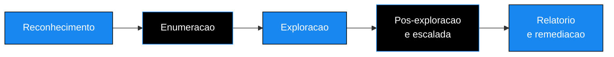

<!-- ══════════════════════ IDIOMAS / LANGUAGES ══════════════════════ -->

<!-- ══════════════════════════ BANNER ══════════════════════════ -->

  

  

  

 

<!-- Cabeçalho animado -->

  

<h1 align="center">Cybersec Portfolio</h1>

<em>Evidência prática de testes de invasão conduzidos em ambientes legais e autorizados, do reconhecimento ao relatório executivo.</em>

 

<!-- ══════════════════════════ NAVEGAÇÃO ══════════════════════════ -->

 

<!-- ══════════════════════════ SOBRE ══════════════════════════ -->

## Sobre este portfólio

Sou Douglas Cshunderlick, analista de cibersegurança com foco em pentest, defesa de redes e análise de ameaças. Cada pasta deste repositório documenta um comprometimento real, executado em laboratório autorizado (TryHackMe, HackTheBox e ambientes próprios), com a mesma estrutura que eu entregaria a um cliente: prova de conceito, caminho de ataque passo a passo e recomendações priorizadas de correção.

A ideia não é só "capturar a flag". É mostrar como penso uma invasão de ponta a ponta e, principalmente, como traduzo o achado técnico em risco de negócio e em um plano de remediação que a equipe consegue executar.

  

<!-- ══════════════════════════ METODOLOGIA ══════════════════════════ -->

## Como cada teste é conduzido

Todo relatório segue o mesmo fluxo, alinhado ao OSSTMM e ao OWASP Testing Guide. As cinco fases abaixo são clicáveis no índice e aparecem detalhadas em cada caso.

| Fase | O que acontece |
|:--|:--|
| **Reconhecimento** | Mapeamento da superfície exposta, portas e serviços vivos |
| **Enumeração** | Investigação de cada serviço em busca de versão, configuração fraca e credencial |
| **Exploração** | Obtenção do primeiro acesso, com confirmação ativa da falha |
| **Pós-exploração** | Movimentação lateral e escalada até o controle total |
| **Relatório** | Tradução do achado em impacto de negócio e correção priorizada |

  

<!-- ══════════════════════════ RELATÓRIOS ══════════════════════════ -->

## Relatórios de teste de invasão

| Máquina | Plataforma | Dificuldade | Tempo até root | Vetor principal | Status |
|:--|:--:|:--:|:--:|:--|:--:|
| **Poster** | TryHackMe | Média | ~1h40 | PostgreSQL com credencial padrão + `CVE-2019-9193` | Concluído |
| **Meow** | HackTheBox | Fácil | ~45min | Telnet com login de root direto (Alpine mal configurado) | Concluído |

Clique em cada caso para abrir o resumo do ataque sem sair desta página.

<b>Poster · comprometimento total via PostgreSQL exposto</b>

 

> Banco PostgreSQL acessível pela rede com a senha de fábrica abriu a porta para execução de comandos no servidor. A partir daí, credenciais guardadas em texto puro e uma regra de `sudo` sem senha levaram ao acesso de root em menos de duas horas.

**Caminho resumido**

1. Varredura revelou a porta `5432` (PostgreSQL) aberta para a rede.
2. Login com a credencial padrão `postgres:password`.
3. Execução de comando no sistema explorando a `CVE-2019-9193` (função `COPY FROM PROGRAM`).
4. Leitura de arquivos de configuração com credenciais do usuário `dark` em texto puro.
5. Regra de `sudo` sem senha permitiu virar root.

**Por que importa:** três falhas isoladas e banais (senha de fábrica, segredo no código, `sudo` permissivo) encadeadas viram comprometimento crítico do servidor inteiro.

<b>Meow · acesso de root direto por Telnet</b>

 

> Um serviço Telnet exposto aceitava login de root sem qualquer barreira. Caso clássico de exposição de serviço legado que não deveria estar acessível.

**Caminho resumido**

1. Varredura revelou a porta `23` (Telnet) aberta.
2. Conexão direta e login como `root`, sem senha forte no caminho.
3. Controle total imediato da máquina.

**Por que importa:** serviços antigos em texto puro como Telnet não pertencem a nenhuma superfície moderna. A correção é desligar o serviço e bloquear a porta, não "colocar uma senha melhor".

 

Novos relatórios entram aqui conforme são concluídos.

  

<!-- ══════════════════════════ SKILLS ══════════════════════════ -->

## Competências demonstradas

<table>
<tr>
<td valign="top" width="50%">

**Ofensiva**

- Reconhecimento e enumeração de serviços (Nmap, Gobuster, ffuf)
- Exploração de serviços expostos (PostgreSQL, SMB, HTTP, Telnet)
- Uso de credenciais padrão e segredos guardados em texto puro
- Escalada de privilégios em Linux (sudoers, SUID, capabilities)
- Exploração de CVEs conhecidas com prova de conceito

</td>
<td valign="top" width="50%">

**Consultiva**

- Documentação profissional de pentest (resumo executivo + técnico)
- Classificação de severidade e priorização de risco
- Recomendações de correção com prazo sugerido
- Tradução de achado técnico em impacto de negócio
- Alinhamento a OSSTMM e OWASP Testing Guide

</td>
</tr>
</table>

  

<!-- ══════════════════════════ ROADMAP ══════════════════════════ -->

## Próximos relatórios

- [ ] Web Application Pentest cobrindo o OWASP Top 10
- [ ] Comprometimento inicial em Active Directory
- [ ] Configurações inseguras em nuvem (AWS e Azure)
- [ ] Automação de reconhecimento com Python e Bash

  

<!-- ══════════════════════════ CONTATO ══════════════════════════ -->

## Contato

  

<em>Se o conteúdo te ajudou, uma estrela no repositório ajuda bastante. Obrigado pela visita.</em>

  

