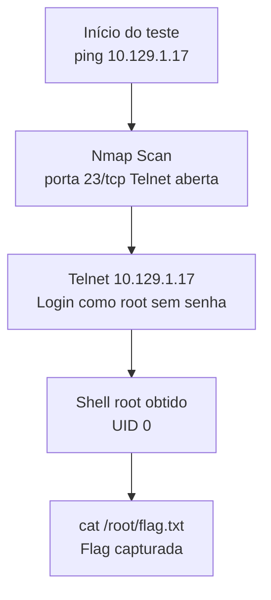

# 🛡️ Relatório de Teste de Invasão: Máquina "Meow" (HackTheBox)

**Classificação**: Público (Portfólio)  
**Data do Teste**: 07 de Dezembro de 2025  
**Tempo Total para Root**: ~20min (aproximadamente entre o nmap e a leitura da flag)  
**Metodologia**: PTES + OSSTMM + RabbitSec Red Team  
**Resultado**: Comprometimento total do sistema (Root Shell)

## 2. Resumo Executivo e Impacto
O sistema testado (Meow – IP 10.129.1.17) apresentou uma falha crítica de configuração que permitiu a um atacante externo, sem credenciais iniciais, obter controle total do servidor (shell root) em poucos minutos após a enumeração de serviços.

A vulnerabilidade mais grave foi a **exposição direta do serviço Telnet (porta 23/tcp)**, que estava configurado para permitir o login direto como root (superusuário), sem exigir senha ou aceitando credenciais padrão. Esta falha de acesso direto ao privilégio máximo é considerada uma das configurações de segurança mais negligentes e críticas.

A partir desse ponto de entrada inicial foi possível:  
-Obter uma sessão de terminal interativo com o usuário root (privilégios máximos)  
-Acessar imediatamente arquivos sensíveis do sistema, incluindo a flag de comprometimento (flag.txt) localizada no diretório /root  
-Demonstrar o comprometimento completo do servidor de forma instantânea

**Risco**: Crítico (CVSS 10.0/10) – Comprometimento total do servidor

### Falhas Críticas Encontradas (P0)

| ID   | Título                                             | Severidade | CVE / Referência                  | Ação no Ataque                          |
|------|----------------------------------------------------|------------|-----------------------------------|-----------------------------------------|
| M-01 | Exposição do Serviço Telnet Permitindo Login Root Direto | Crítica    | Misconfiguration (OWASP A05:2021) | Acesso imediato como root (UID 0)       |

### 6. Caminho Completo de Exploração (Attack Path)

## 🔗 Referência

O relatório completo (incluindo metodologia, *timeline* visual e *proofs* detalhados) está disponível no arquivo:
[relatorioMeowRabbitSec.pdf](https://drive.google.com/file/d/1LAf9lfxStpVRk0boy80lkZZyj2mNtN4w/view?usp=sharing)
